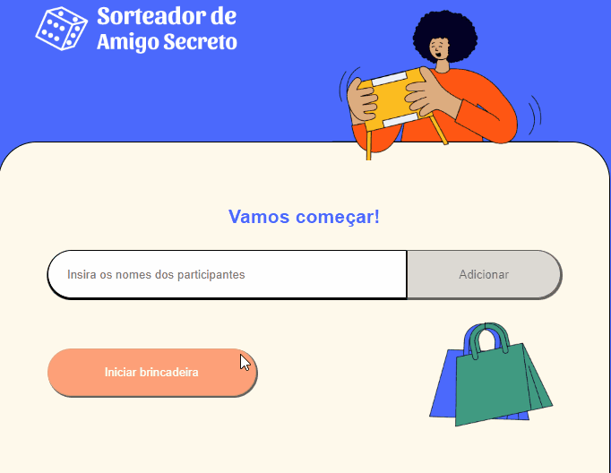

# SORTEADOR
Criação e implementação dos testes de uma aplicação de sorteio de amigos secretos.

Na primeira página inserimos os nomes dos participantes e na segunda página é feito o sorteio.

## Objetivos

* Aprender desenvolvimento orientado a testes - TDD
* Implementar:
    - Testes de comportamento
    - Testes de Função Pura
    - Testes de Snapshot
    - Interação com elementos

## Para rodar o projeto

* No diretório do projeto, execute: `npm start` para abrir o projeto no navegador. 
* Abra um novo terminal no diretório do projeto e execute `npm test` para abrir a tela de testes no modo interativo.

